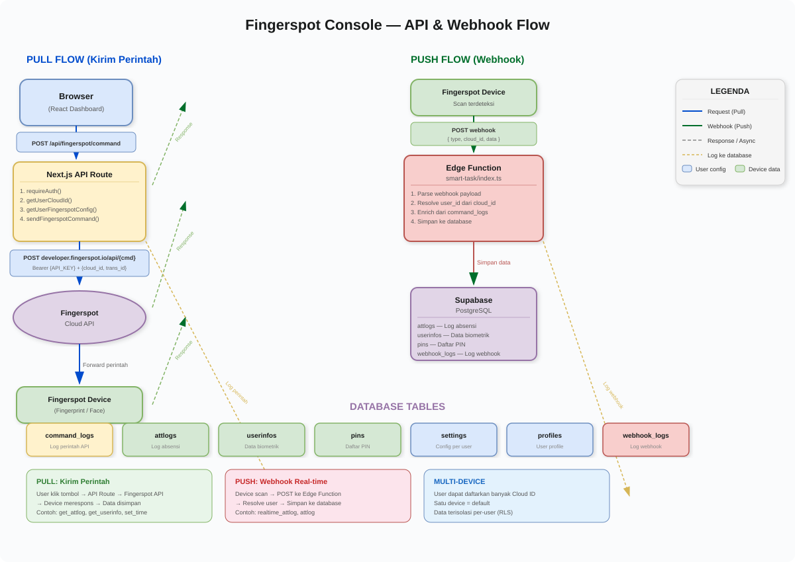

<p align="center">
  
  
  
  
  
</p>

<h1 align="center">🏢 Fingerspot Enterprise Console</h1>

<p align="center">
  <b>Dashboard web untuk mengelola perangkat biometrik Fingerspot secara cloud-based.</b><br>
  Kirim perintah ke device, terima data real-time via webhook, pantau semua aktivitas dalam satu panel.
</p>

<p align="center">
  <a href="#fitur-utama">Fitur</a> •
  <a href="#cara-kerja">Cara Kerja</a> •
  <a href="#setup-lokal">Setup</a> •
  <a href="#deploy-ke-vercel">Deploy</a> •
  <a href="#api-endpoints">API</a> •
  <a href="#troubleshooting">Troubleshooting</a>
</p>

---

## Tech Stack

| Layer | Teknologi |
|-------|-----------|
| Framework | Next.js 15 (App Router) |
| UI | React 19, Tailwind CSS 4 |
| Database | Supabase (PostgreSQL) |
| Auth | Supabase Auth + Session Cookie |
| Email | Resend |
| State | Zustand |
| Bahasa | TypeScript |

## Fitur Utama

| Fitur | Deskripsi |
|-------|-----------|
| Dashboard | Ringkasan statistik: total scan, user aktif, device terhubung |
| Attendance Logs | Riwayat absensi dari semua device, filter tanggal & PIN |
| User Info | Data biometrik pengguna (fingerprint, face, PIN) |
| PIN List | Daftar PIN terdaftar di setiap device |
| API History | Log semua perintah yang dikirim ke Fingerspot API |
| Webhook History | Log semua data yang diterima dari device via webhook |
| API Tester | Tester interaktif untuk semua perintah Fingerspot |
| Settings | Konfigurasi Cloud ID, API token, theme, bahasa |
| Dark/Light Mode | Toggle tema gelap/terang |
| Multi Language | Indonesia & English |

## Cara Kerja

<p align="center">
  
</p>

### Arsitektur Umum

```
┌─────────────┐
│   Browser   │  React Dashboard (User Interface)
│  (Client)   │
└──────┬──────┘
       │
       ▼
┌──────────────────────────────────────────────────────────┐
│                  Next.js API Routes                       │
│  /api/fingerspot/command    /api/settings                 │
│  /api/attendance-logs       /api/user-info                │
│  /api/pin-list              /api/api-history              │
└──────┬──────────────┬────────────────────┬───────────────┘
       │              │                    │
       ▼              ▼                    ▼
┌────────────┐ ┌─────────────┐  ┌─────────────────────────┐
│ Fingerspot │ │  Supabase   │  │  Supabase Edge Function  │
│ Cloud API  │ │ PostgreSQL  │  │  (smart-task)            │
│            │ │  Database   │  │  Webhook receiver        │
└─────┬──────┘ └─────────────┘  └──────────┬──────────────┘
      │                                     │
      ▼                                     │
┌─────────────┐                            │
│  Fingerspot │ ◄──── POST webhook ─────────┘
│   Device    │      (real-time push)
│ (Fingerprint│
│  /Face)     │
└─────────────┘
```

### Alur Pull (Kirim Perintah)

```
User klik tombol di dashboard
  → POST /api/fingerspot/command
  → Next.js resolve Cloud ID & API Token dari settings
  → POST ke Fingerspot Cloud API (https://developer.fingerspot.io/api/{command})
  → Device merespons
  → Data disimpan ke database
  → Log tersimpan di command_logs
```

### Alur Push (Webhook)

```
Device mendeteksi scan fingerprint
  → POST ke Supabase Edge Function (smart-task)
  → Edge Function resolve user_id berdasarkan cloud_id
  → Data disimpan ke attlogs / userinfos / pins
  → Log tersimpan di webhook_logs
```

### Multi-Device

```
User dapat mendaftarkan banyak Cloud ID (device)
  → Satu device dijadikan default
  → Setiap operasi menggunakan Cloud ID yang dipilih
  → Data terisolasi per-user (RLS di Supabase)
```

## Yang Perlu Disiapkan

### 1. Akun & Layanan

| Layanan | Keperluan | Gratis? |
|---------|-----------|---------|
| [Supabase](https://supabase.com) | Database, Auth, Edge Functions, Storage | Ya (500MB DB, 1GB storage) |
| [Fingerspot Cloud](https://developer.fingerspot.io) | API untuk komunikasi dengan device | Ya (device-dependent) |
| [Resend](https://resend.com) | Email OTP, password reset | Ya (100 email/hari) |
| [Vercel](https://vercel.com) *(opsional)* | Deploy Next.js | Ya (hobby) |

### 2. Buat Project Supabase

1. Buat project baru di [Supabase Dashboard](https://supabase.com/dashboard)
2. Buka **SQL Editor** di dashboard Supabase
3. Jalankan migration file:
   ```sql
   -- Jalankan isi dari:
   -- supabase/migrations/20260812_complete_setup.sql
   ```
4. Buka **Storage** → buat bucket `avatars` (public)
5. Copy **Project URL** dan **Anon Key** dari Settings → API

### 3. Buat Akun Fingerspot Cloud

1. Daftar di [Fingerspot Customer Portal](https://developer.fingerspot.io)
2. Daftarkan device → dapatkan **Cloud ID** (format: `C...` atau `F...`, 16 karakter)
3. Catat **API Token** dari portal
4. Atur **Webhook URL** di portal Fingerspot:
   ```
   https://<project-ref>.supabase.co/functions/v1/smart-task
   ```

### 4. Buat Akun Resend

1. Daftar di [Resend](https://resend.com)
2. Buka **API Keys** → buat key baru → copy key-nya

## Setup Lokal

### Prasyarat

- Node.js 18+ *(direkomendasikan: 20+)*
- npm / yarn / pnpm
- Git

### Instalasi

```bash
# Clone repository
git clone https://github.com/eval-beep/SuperWoW2.git
cd SuperWoW2

# Install dependencies
npm install

# Copy file environment
cp .env.example .env.local
```

### Konfigurasi Environment

Buka `.env.local` dan isi semua variabel:

```env
# Supabase (dari Supabase Dashboard → Settings → API)
NEXT_PUBLIC_SUPABASE_URL=https://xxxxx.supabase.co
NEXT_PUBLIC_SUPABASE_KEY=eyJhbGciOiJIUzI1NiIs...

# Fingerspot API (dari Fingerspot Customer Portal)
FINGERSPOT_API_URL=https://developer.fingerspot.io/api
FINGERSPOT_API_KEY=your-api-key

# Resend (dari Resend Dashboard → API Keys)
RESEND_API_KEY=re_xxxxxxxxxx
```

### Jalankan

```bash
npm run dev
```

Buka [http://localhost:3000](http://localhost:3000) di browser.

## Database Schema

### Struktur Tabel

```
auth.users (Supabase Auth)
    │
    ├──▶ profiles          (profil user: nama, avatar)
    ├──▶ settings          (key-value: cloud_id, api_token, theme)
    ├──▶ otp_codes         (kode OTP untuk verifikasi)
    │
    ├──▶ attlogs           (log absensi)
    ├──▶ userinfos         (data biometrik)
    ├──▶ pins              (daftar PIN)
    ├──▶ command_logs      (log perintah API)
    └──▶ webhook_logs      (log webhook masuk)
```

### Relasi

- Semua tabel data memiliki `user_id` (FK → auth.users) untuk isolasi per-user
- Semua tabel data memiliki `cloud_id` untuk identifikasi device
- `settings` memiliki UNIQUE constraint `(user_id, key)`
- `profiles` dibuat otomatis saat user daftar (trigger)
- RLS aktif di `profiles` dan `otp_codes`

## API Endpoints

### Auth

| Method | Endpoint | Deskripsi |
|--------|----------|-----------|
| POST | `/api/auth/login` | Login email + password |
| POST | `/api/auth/register` | Register akun baru |
| POST | `/api/auth/logout` | Logout |
| POST | `/api/auth/send-otp` | Kirim kode OTP |
| POST | `/api/auth/verify-otp` | Verifikasi OTP |
| POST | `/api/auth/reset-password` | Reset password via email |
| GET | `/api/auth/me` | Ambil data user saat ini |
| PATCH | `/api/auth/profile` | Update profil |

### Data

| Method | Endpoint | Deskripsi |
|--------|----------|-----------|
| GET/PUT | `/api/settings` | Ambil / simpan pengaturan |
| POST | `/api/settings/test` | Test koneksi ke Fingerspot API |
| POST | `/api/fingerspot/command` | Kirim perintah ke device |
| GET | `/api/attendance-logs` | Ambil log absensi |
| GET | `/api/user-info` | Ambil data user info |
| GET | `/api/pin-list` | Ambil daftar PIN |
| GET | `/api/api-history` | Ambil log perintah API |
| GET | `/api/webhook-history` | Ambil log webhook |

## Fingerspot Commands

| Command | Deskripsi |
|---------|-----------|
| `get_device` | Ambil info device (nama, cloud ID, webhook URL) |
| `get_attlog` | Ambil log absensi |
| `get_userinfo` | Ambil data biometrik user |
| `get_all_pin` | Ambil semua PIN terdaftar |
| `set_userinfo` | Tulis data user ke device |
| `delete_userinfo` | Hapus data user dari device |
| `set_time` | Setel jam device |
| `register_online` | Daftarkan device online |
| `restart_device` | Restart device |

## Deploy ke Vercel

```bash
# Install Vercel CLI
npm i -g vercel

# Deploy
vercel

# Set environment variables di Vercel Dashboard
# Settings → Environment Variables
```

> Pastikan environment variable di Vercel identik dengan `.env.local`.

## Struktur Folder

```
src/
├── app/
│   ├── (auth)/login/              # Halaman login/register
│   ├── (dashboard)/               # Semua halaman dashboard
│   │   ├── dashboard/             #   Overview statistik
│   │   ├── attendance-logs/       #   Log absensi
│   │   ├── user-info/             #   Data biometrik
│   │   ├── pin-list/              #   Daftar PIN
│   │   ├── api-history/           #   Log perintah API
│   │   ├── webhook-history/       #   Log webhook
│   │   ├── api-tester/            #   Tester API interaktif
│   │   └── settings/              #   Pengaturan
│   └── api/                       # API route handlers
├── lib/
│   ├── auth-browser.tsx           # Client-side auth (useAuth)
│   ├── auth-server.ts             # Server-side auth (requireAuth)
│   ├── fingerspot.ts              # Fingerspot API client
│   ├── supabase.ts                # Supabase REST client
│   ├── user-settings.ts           # Settings CRUD
│   └── email.ts                   # Resend email integration
├── stores/
│   └── settings.ts                # Zustand store
├── contexts/
│   └── ThemeLanguageContext.tsx    # Theme & i18n provider
└── types/
    └── database.ts                # TypeScript type definitions

supabase/
├── migrations/                    # SQL schema
└── functions/
    ├── smart-task/                # Webhook handler (production)
    └── fingerspot-webhook/        # Webhook handler (legacy)
```

## Troubleshooting

| Masalah | Solusi |
|---------|--------|
| Settings tidak tersimpan | Buka browser console → cek error dari `/api/settings` |
| Device tidak ditemukan | Pastikan Cloud ID benar dan device online di Fingerspot portal |
| Webhook tidak masuk | Pastikan Webhook URL sudah diatur di Fingerspot portal |
| Email tidak terkirim | Cek API key Resend dan pastikan email verified di Resend |
| Auth error | Clear cookies → login ulang |
| Build error | Jalankan `npm run lint` untuk cek error |

---

<p align="center">
  Made with ❤️ for Fingerspot Enterprise
</p>
